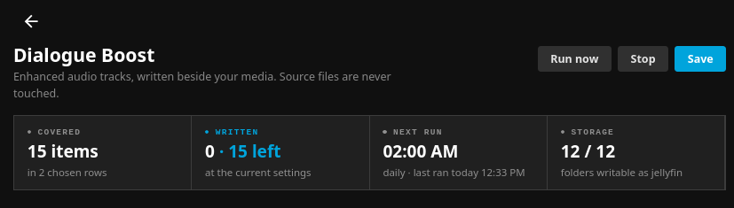
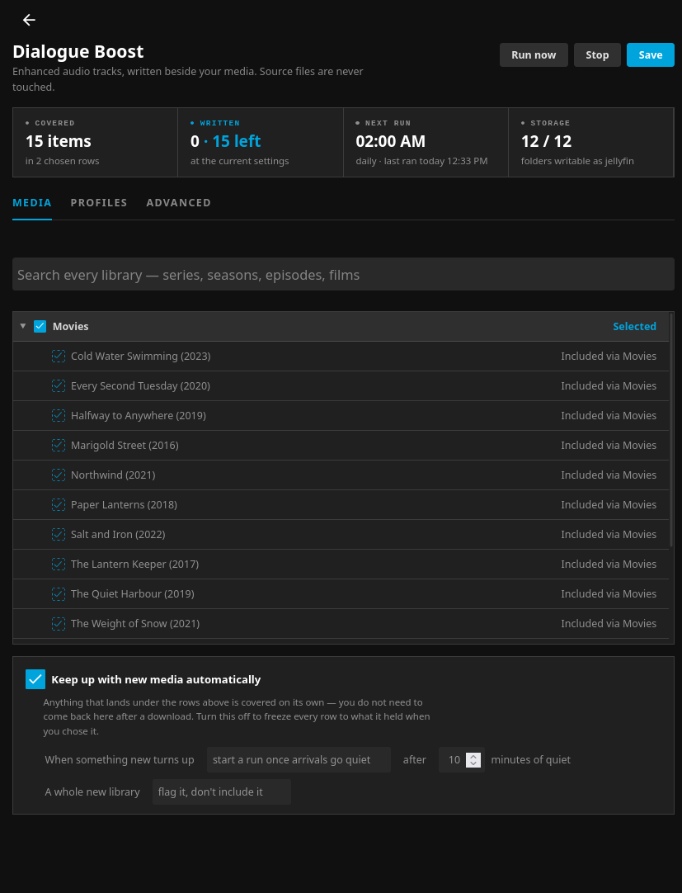
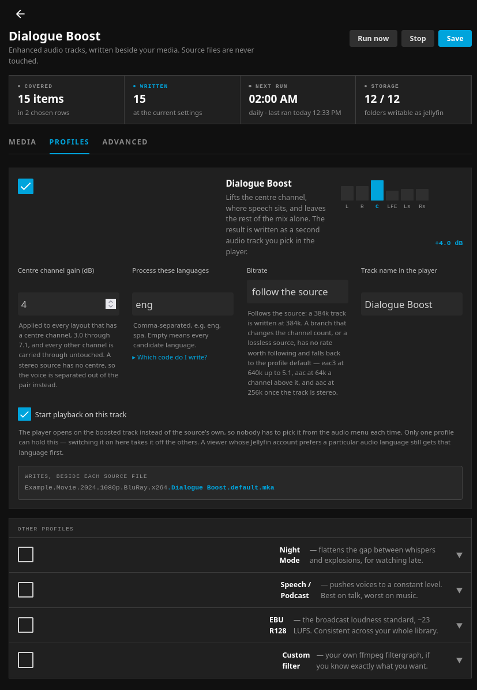
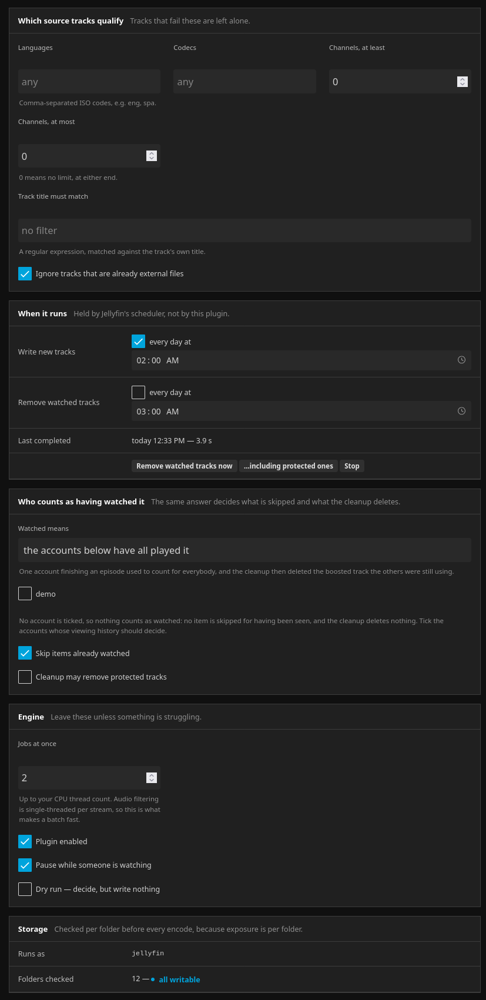
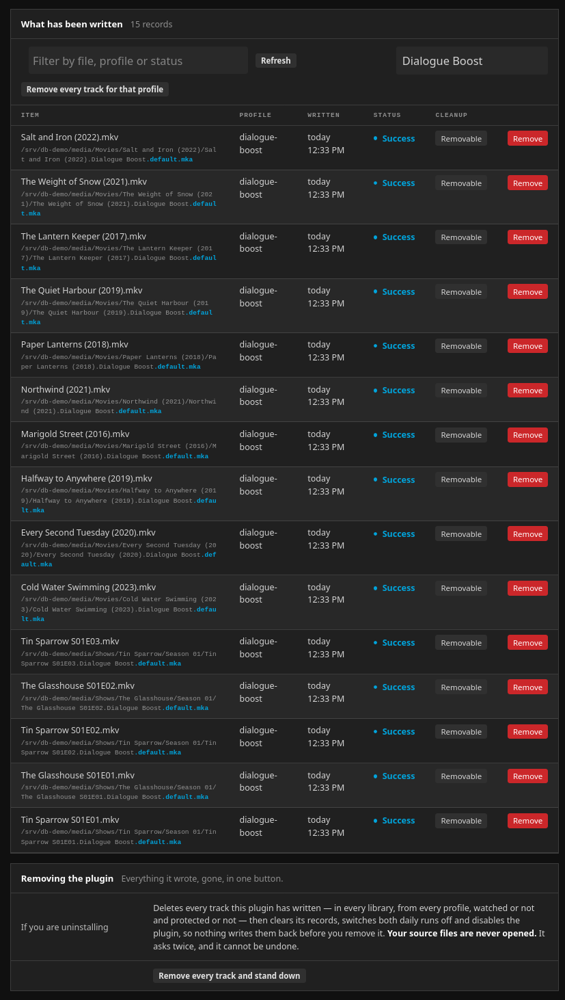

# Dialogue Boost

A Jellyfin plugin that writes a **dialogue-enhanced copy of a film or episode's audio as an extra
selectable track**, beside the original file. Your media is never opened for writing, never
re-muxed, never re-encoded.



## What it writes

One small `.mka` file per item, next to the source:

```
Movies/The Quiet Harbour (2019)/
  The Quiet Harbour (2019).mkv                            ← never touched
  The Quiet Harbour (2019).Dialogue Boost.default.mka     ← what this writes
```

Jellyfin shows it as another audio track on the same item. Pick it from the audio menu — or let the
plugin claim it as the track playback starts on, which is what `.default` in the filename does.

Five profiles decide what the extra track contains:

| | |
|---|---|
| **Dialogue Boost** *(on by default)* | lifts the front centre channel, where speech sits, and leaves the rest of the mix alone. A stereo source has no centre, so the voice is separated out of the pair instead |
| **Broadband Night Mode** | flattens the gap between whispers and explosions, for watching late |
| **Speech / Podcast** | pushes voices to a constant level |
| **EBU R128** | the broadcast loudness standard, −23 LUFS, consistent across the library |
| **Custom** | your own ffmpeg filter graph |

## Requirements

- **Jellyfin 10.11** (built and tested against 10.11.11, .NET 9)
- **Linux** — see [Platforms](#platforms) below; Windows and macOS are untested
- No separate ffmpeg install — the plugin uses the encoder Jellyfin already has configured
- Disk space for the sidecars, which are a few hundred MB per film at most, not a copy of the video

## Platforms

**It has only ever run on Linux.** That is where it was written and where every measurement in this
repository was taken. Docker counts as Linux: Jellyfin's official image is a Linux container
whatever the host underneath it happens to be.

**Windows and macOS are untested.** Nothing here is written for one platform — paths are built with
`Path.Combine`, ffmpeg is invoked through an argument list rather than a shell string, the temporary
file is written beside its target so publishing is a same-volume rename everywhere, and **no native
code ships**: the plugin uses the SQLite and the ffmpeg that Jellyfin already provides for your
platform. The one platform-specific call in the codebase is guarded, and the compiler's
platform-compatibility analyzer is switched on and silent, so a guard going missing shows up as a
build warning here rather than as a surprise on somebody else's server.

That is a reason to expect it to work. It is not evidence that it does, and one difference is known
and worth naming: on Windows, replacing a sidecar while a client still holds that file open fails,
where Linux allows it. The run reports a failed item and the next one redoes it — nothing is
corrupted, and your source files are never opened either way — but a busy Windows server may take a
second run to finish.

If you do run it on Windows or macOS, [say so](https://github.com/atsugvA/DialogueBoost/issues)
either way. That is the single most useful thing anyone can add right now.

## Install

### From the plugin repository

1. **Dashboard → Plugins → Repositories → `+`**
2. Name it anything; the URL is:
   ```
   https://raw.githubusercontent.com/atsugvA/DialogueBoost/main/manifest.json
   ```
3. **Dashboard → Plugins → Catalogue → Dialogue Boost → Install**
4. Restart Jellyfin.

### Manually

Download the `.zip` from [Releases](https://github.com/atsugvA/DialogueBoost/releases), extract it
into a folder named `Dialogue Boost_<version>` under your Jellyfin plugin directory, and restart:

```bash
sudo mkdir -p "/var/lib/jellyfin/plugins/Dialogue Boost_1.0.0.0"
sudo unzip dialogue-boost_1.0.0.0.zip -d "/var/lib/jellyfin/plugins/Dialogue Boost_1.0.0.0"
sudo chown -R jellyfin:jellyfin "/var/lib/jellyfin/plugins/Dialogue Boost_1.0.0.0"
sudo systemctl restart jellyfin
```

The plugin directory is `/var/lib/jellyfin/plugins/` on most Linux installs — **not**
`~/.local/share/jellyfin/plugins/`. On Docker it is `/config/plugins` inside the container.

### From source

```bash
git clone https://github.com/atsugvA/DialogueBoost.git
cd DialogueBoost
./scripts/deploy.sh
```

Needs the .NET 9 SDK. `deploy.sh` builds, installs to `/var/lib/jellyfin/plugins/`, and waits for
the server to answer before returning.

## First run

Open **Dashboard → Plugins → Dialogue Boost**. Three things decide whether anything happens:

**1. Choose libraries.** Nothing is in scope until you tick something. A row covers everything
under it, resolved when the run happens — so anything you download next week is covered without
coming back here.



**2. Check the language.** This is the one that catches people. **Process these languages** ships
as `eng`, so a library whose tracks are tagged `deu`, `fra`, `spa` — or not tagged at all —
produces **nothing, with no error**. Set it to your own language, or clear the field to mean *every
language*. The **Overview** tab tells you what a run would do before you start one.

**3. Press *Run now*,** or leave it: the plugin runs daily at 02:00 by default, and picks up new
media on its own about ten minutes after a download goes quiet.



Each profile card shows the filename it will write and the channel it will lift, updating as you
type — so you can see what a setting does before saving it.

## What it does not do without being asked

Out of the box the plugin only ever **adds** files:

- **Nothing is skipped for being watched, and nothing is ever deleted**, because *Watched by* ships
  as "the accounts below have all played it" with **no account chosen**. With nobody chosen, nothing
  counts as watched. Ticking accounts is what turns on both skipping and the cleanup that removes
  tracks once everybody has seen them.
- **A new library is flagged, not swept in.**
- **Two jobs at a time**, paused while somebody is streaming, so the first run does not make the
  server unusable.



## Removing it

Everything the plugin wrote can be removed in one button — **Advanced → Remove every track and
stand down**. It disables the plugin and clears both scheduled runs *before* deleting, because a
library emptied in the afternoon with the daily run still scheduled is full again by morning.

It finds tracks two ways — by looking beside every item in every library, and by what its own
records name — and deletes only what it can account for. A `.mka` file it did not write is left
alone.



## How it decides things

Short version; [docs/ARCHITECTURE.md](docs/ARCHITECTURE.md) has the long one with the measurements.

- **The codec is chosen to keep your channel count.** `eac3` up to 5.1, `aac` above it because eac3
  silently folds 6.1 and 7.1 down to 5.1. Height layouts that aac refuses fall back to eac3's fold.
- **The bitrate follows the source** where that means something, and falls back to a table where it
  does not — a branch that changes the channel count, or a lossless source whose rate says nothing
  about its content.
- **A run that finds everything current does nothing**, in seconds. Work is keyed on the settings
  *and* the source's own audio, so changing a setting re-encodes only what that setting affects.
- **The source is never opened for writing.** Sidecars are written to a temporary file, verified
  with ffprobe, then moved into place.

## Building and testing

```bash
dotnet build -c Release
dotnet test Jellyfin.Plugin.DialogueBoost.Tests/Jellyfin.Plugin.DialogueBoost.Tests.csproj
```

A bare `dotnet test` in the repo root silently does nothing — it resolves the root project, which
is not a test project. Name the test project.

`scripts/` also holds the two harnesses that check the audio itself against real ffmpeg, and a probe
that loads the config page in a real browser through Jellyfin's own router. See
[CONTRIBUTING.md](CONTRIBUTING.md).

## A note on how this was built

This plugin was written with heavy use of AI assistance. That is worth saying plainly, because it
changes what you should check rather than whether it works.

What that meant in practice: behaviour was verified against a running Jellyfin and real ffmpeg
rather than argued from documentation. Per-channel levels are read back off encoded output; source
files are hashed before and after every run; the configuration page is loaded through Jellyfin's own
router in a real browser rather than rendered standalone. Where a comment in this code says
something was measured, it was measured — several of them exist because the obvious answer turned
out to be wrong.

It has been exercised on Linux, on Jellyfin Web and the official Android TV client. Other clients
should work through the same external-audio mechanism, and other operating systems through the same
.NET — but neither has been tested, and [Platforms](#platforms) says what that does and does not
buy you.

## License

[GPL-3.0](LICENSE). Jellyfin's own `Jellyfin.Controller` and `Jellyfin.Model` assemblies, which this
plugin links against, are `GPL-3.0-only`.
